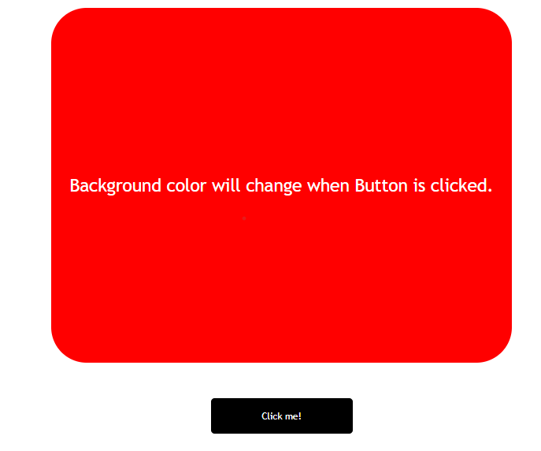

# Mohan Chindam

- Different Javascript DOM concepts were used to manipulate the DOM created using html.
- Targeting elements, updating element's internal text and event handlers are the concepts used to develop this webpage.
- Learnt how to utilize random number according to requirement.
- Spent nearly 15mins to complete this webpage development.
- HTML, CSS, and javascript are the technologies used to develop this webpage.

- Below image shows the preview of Project

Project is deployed on **Netlify**:
- You can preview Project here, [**ColorChanger**]()

